CUDA Denoiser For CUDA Path Tracer
==================================

**University of Pennsylvania, CIS 565: GPU Programming and Architecture, Project 4**

* Sydney Miller
  * [LinkedIn](https://www.linkedin.com/in/sydney-miller-upenn/)
* Tested on: GTX 222 222MB (CETS Virtual Lab)

### README

| Original | Denoised |
| ------------- | ----------- | 
| 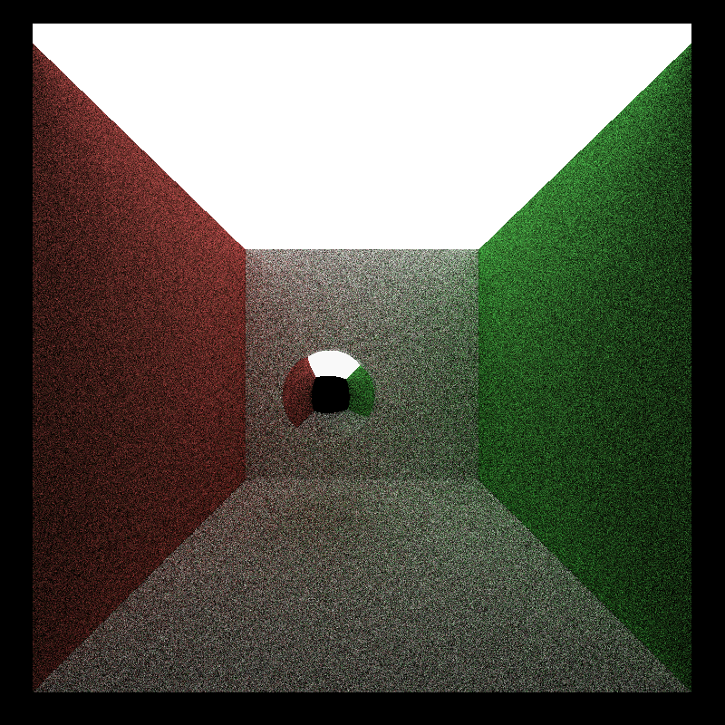  | 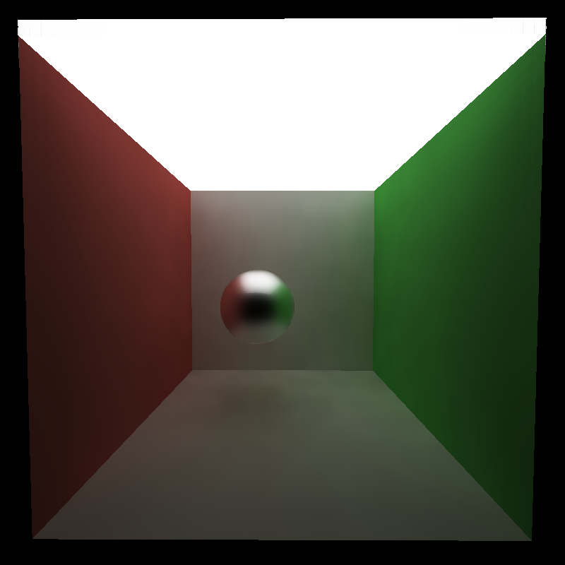| 

### Results

#### Smoothness Based on Iterations 
| 1 Iteration | 3 Iterations | 7 Iterations | 10 Iterations |
| ------------- | ----------- | ------------- | ----------- |
|   | | 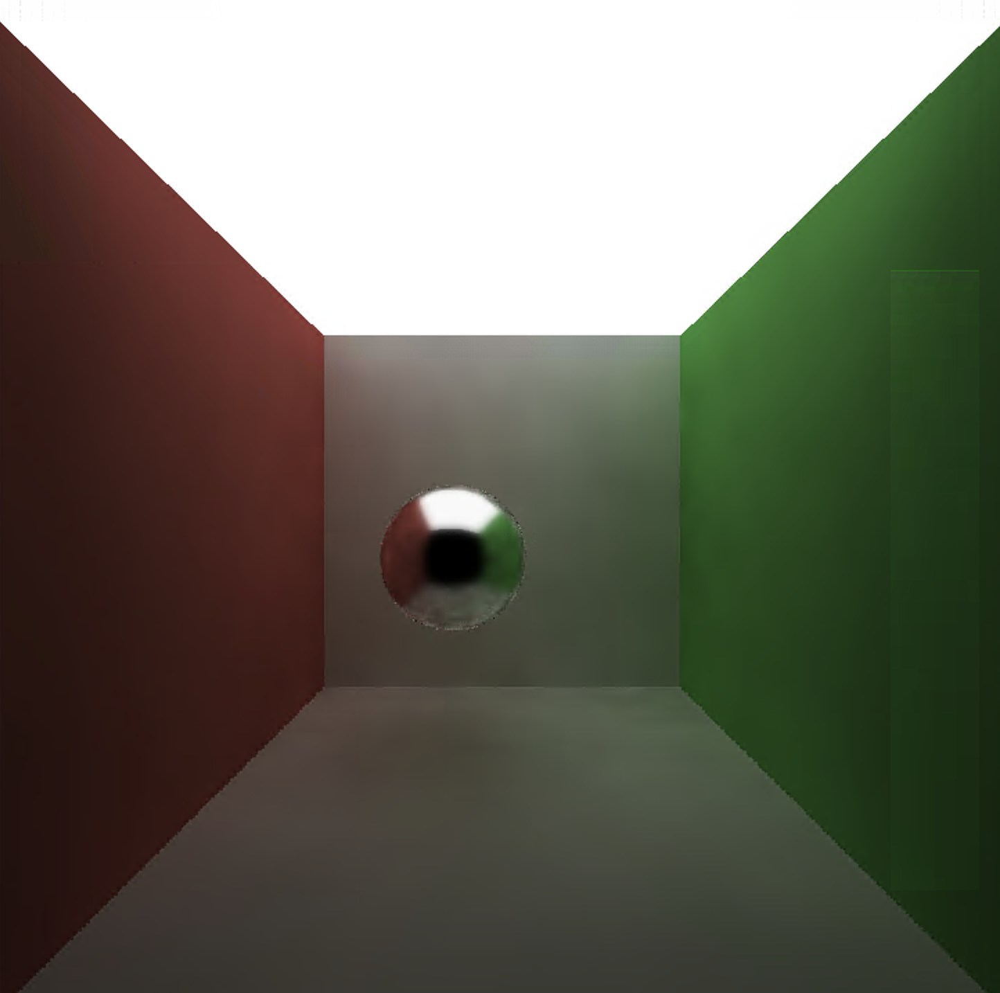  |  |

Looking at these images, it took about 7 iterations to get a smooth image. With the iterations less than 7, there are some artifacts around the specular sphere.

#### Denoising Different Materials
| Specular | Diffuse | Refractive | 
| ------------- | ----------- | ------------- | 
| 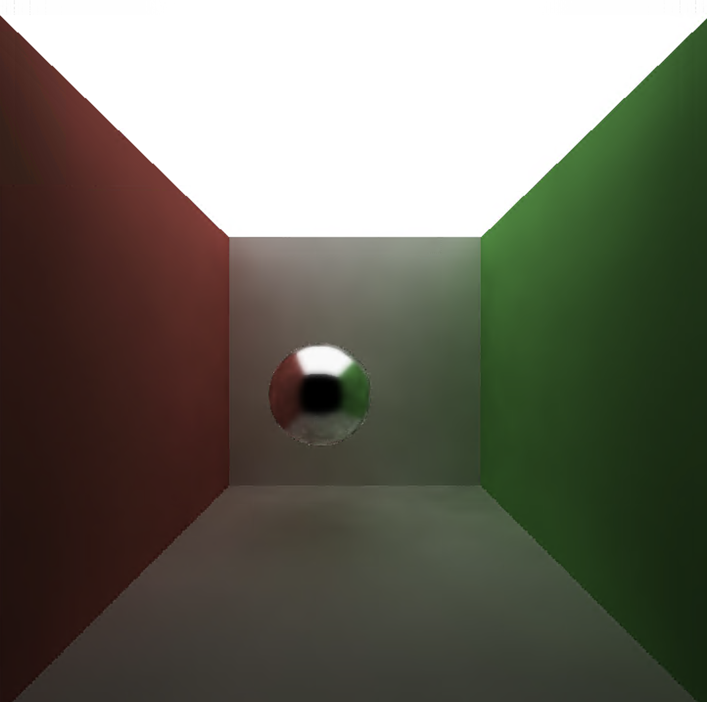  | 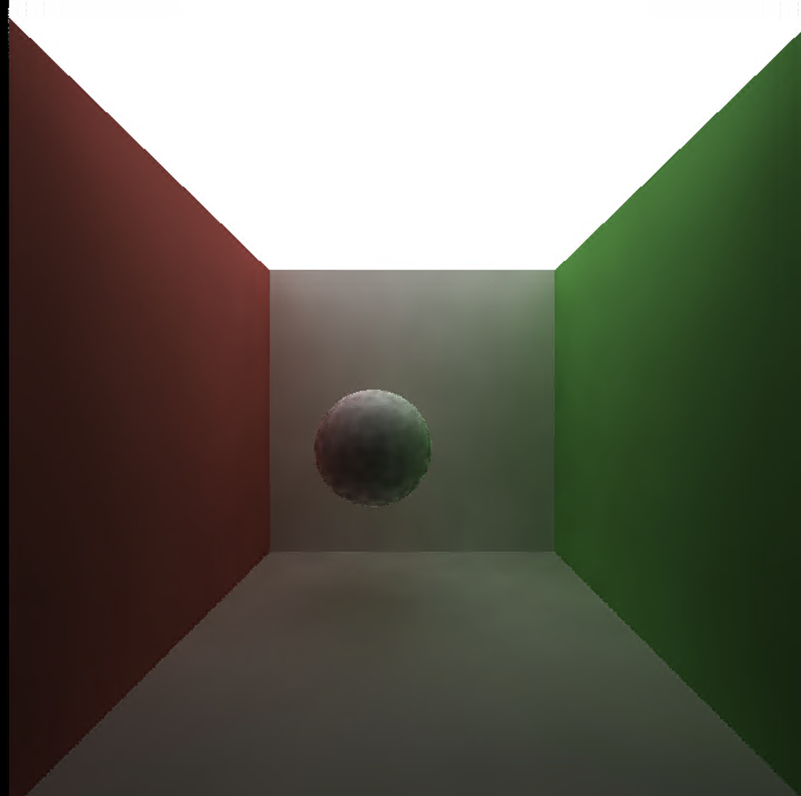| 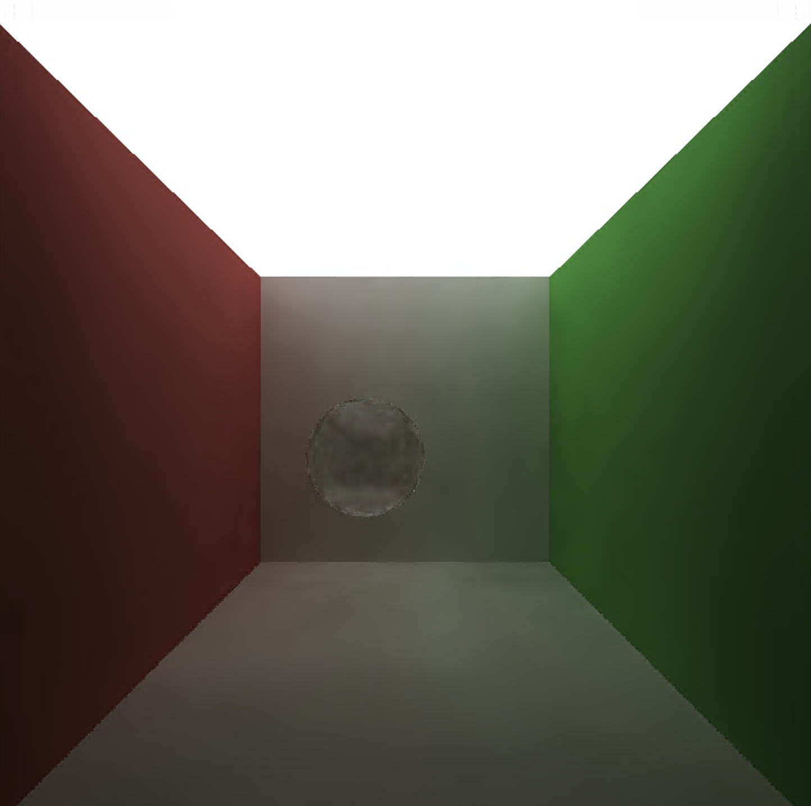 | 

The render with diffuse walls and specular sphere looks the best. The surface of the diffuse sphere has some artifcats. The refractive sphere does not look refractive anymore. With different parameters maybe the other materials on the sphere would look better. The paramters used here were: Filter Size: 156, Color Weight: 3.5, Normal Weight: 0.005, and Position Weight: 0.2.

#### Denoising With Different Filter Sizes
| 10 x 10 px | 25 x 25 px | 50 x 50 px | 100 x 100 px |
| ------------- | ----------- | ------------- | ----------- |
| 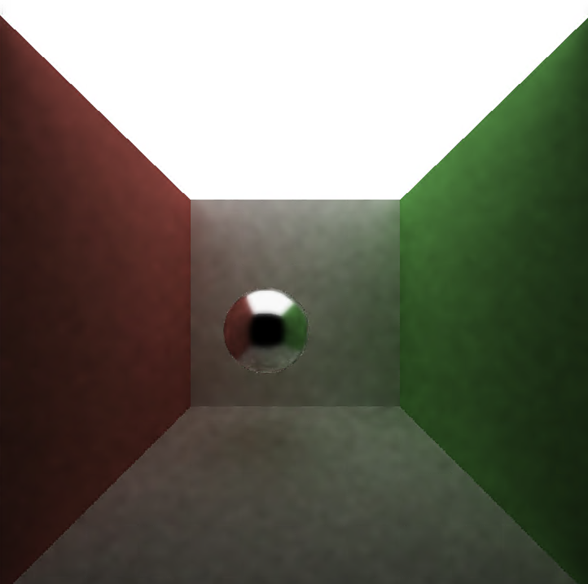  | 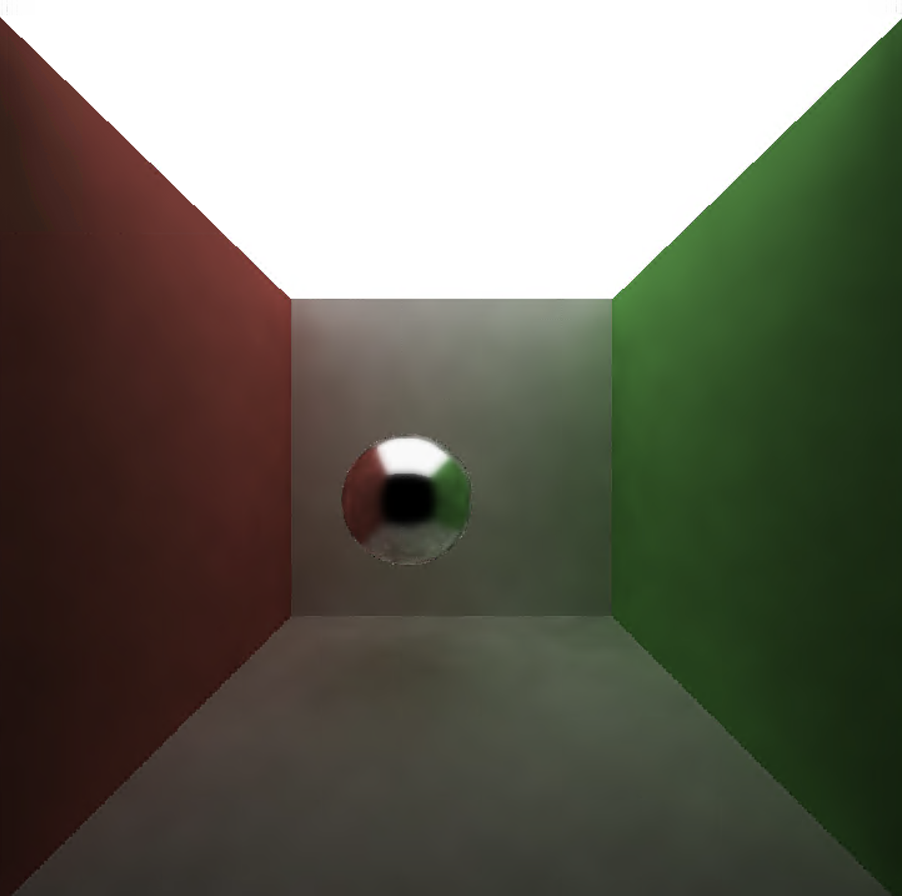|   | 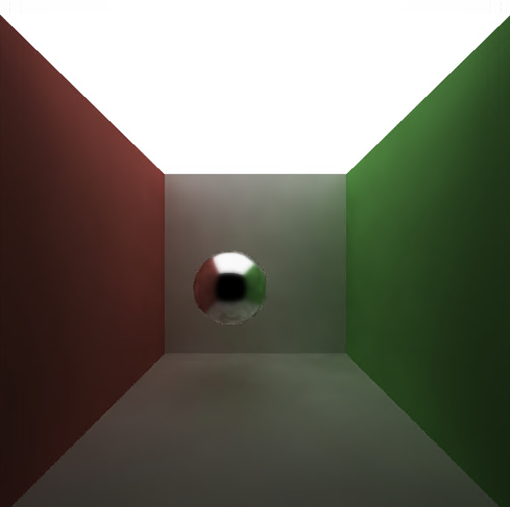 |

You can see that lower filter sizes make for a more noticible grid patter in the image.

#### Comparing Different Scenes
| Large Light | Small Light |
| ------------- | ----------- | 
|   | 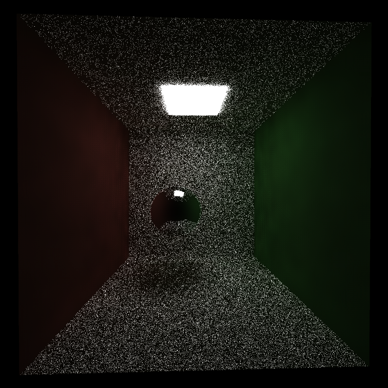| 

With the same parameters, the scene with the smaller light has a siginifcant lower quality than the scene with the larger light. Maybe the brighter scenes looks better because there is less darker pixels after each iteration since there is a higher probability of rays reaching the light. The paramters used here were: Filter Size: 156, Color Weight: 3.5, Normal Weight: 0.005, and Position Weight: 0.2.

### Performance Analysis

#### Runtime at Different Resolutions
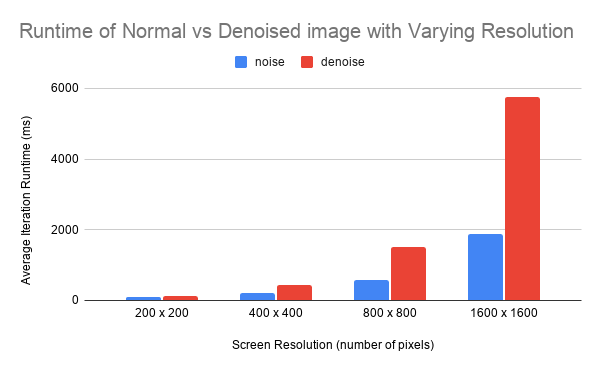

This graph shows that for each tested resolution, the average iteration runtime in ms is greater for the denoised image than the noisy image. This makes sense since more work is being done per iteration for the denoised image.

#### Runtime with Varying Filter Sizes
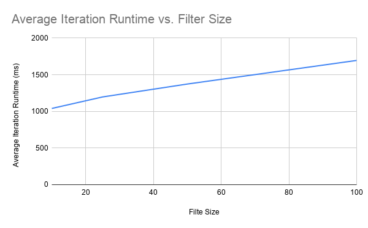

This chart shows that the average runtime per iteration increases with increasing filter sizes, however the runtime increase is smaller as the filter goes up. The increase in runtime is still significant though. 

### Bloopers
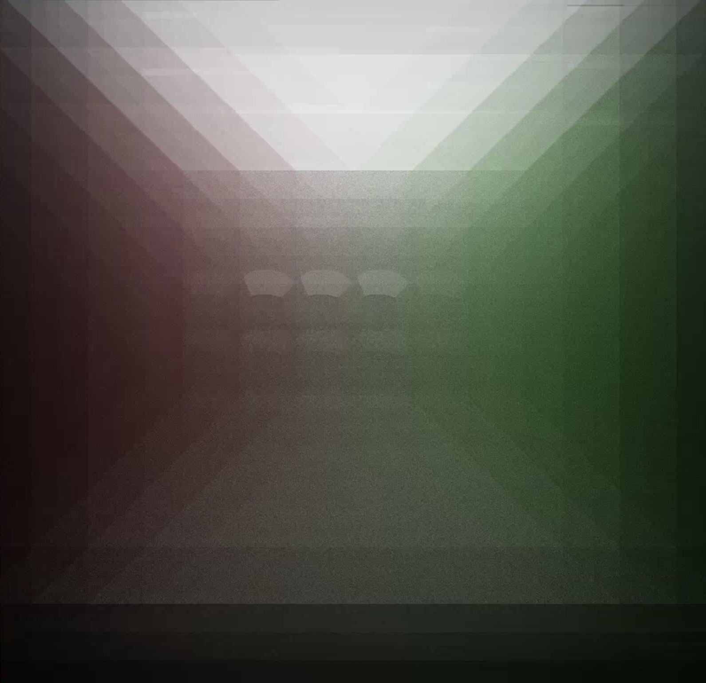
